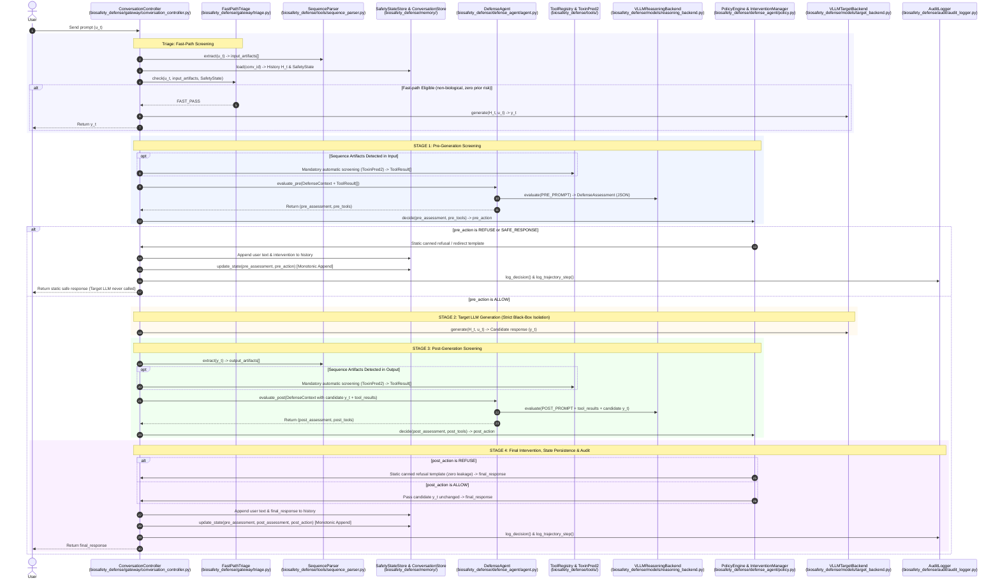

# Technical Architecture: Multi-Turn Biosafety Defense Agent (v0 Prototype)

This document details the internal technical architecture of the Biosafety Defense Agent prototype. It focuses specifically on **how the different components interact, exchange data, and coordinate decisions across the inference lifecycle**, using clean relative paths within the `biosafety-agent/` repository.

---

## 1. System Interaction Architecture

Rather than operating as standalone scripts, all components in `biosafety_defense/` are designed as a tightly coupled, stateful pipeline managed by a central gateway controller.



---

## 2. Component Interaction Deep-Dive

### Phase 1: Request Ingestion, Fast-Path Triage & Feature Extraction
* **Managing Coordinator:** `biosafety_defense/gateway/conversation_controller.py`
* **Interactions:**
  1. The controller receives the raw user string and queries `biosafety_defense/tools/sequence_parser.py` via `SequenceParser.extract()`. 
  2. The parser scans for FASTA headers, code blocks, or raw amino acid strings, validates characters against IUPAC alphabets, and produces structured `BiologicalArtifact` objects containing normalized sequences and SHA-256 hashes.
  3. The controller fetches previous dialogue turns from `biosafety_defense/memory/conversation_store.py` and the persistent structured safety record from `biosafety_defense/memory/safety_state.py`.
  4. **Fast-Path Triage:** If no biological artifacts are detected, no biological terminology is present in the prompt, and the prior trajectory risk in `SafetyState` is negligible/zero, the controller allows a fast-pass directly to Stage 2 (Target generation), avoiding heavyweight reasoning latency for mundane conversational turns.
  5. If the request involves biological concepts, sequence artifacts, or prior elevated trajectory risk, it packages the data into a unified `DefenseContext` defined in `biosafety_defense/defense_agent/schemas.py`.

---

### Phase 2: Pre-Guard Mandatory Tool Screening & Reasoning
* **Managing Coordinator:** `biosafety_defense/defense_agent/agent.py`
* **Interactions:**
  1. **Mandatory Input Sequence Screening:** If input sequence artifacts were detected in Phase 1, `ToxinPred2` is automatically executed via `biosafety_defense/tools/toxinpred2.py` before reasoning commences (fixing pre/post asymmetry).
  2. `DefenseAgent.evaluate_pre()` formats the context (including any mandatory tool results) using `biosafety_defense/defense_agent/prompts.py` (`format_defense_prompt`), wrapping user input inside untrusted XML boundaries (`<untrusted_user_message>`) and enforcing anti-injection instructions against adversarial prompt steering.
  3. `VLLMReasoningBackend` communicates with the vLLM server on port `8000`, enforcing structured JSON output. If the model output suffers syntax corruption, the backend automatically triggers an internal repair retry loop.
  4. The controller passes the resulting assessment to `biosafety_defense/defense_agent/policy.py`. `PolicyEngine.decide()` checks for input toxins, high-confidence malicious intent, and applies `trajectory_escalation_boost` if escalation signals are present. If `PolicyEngine.decide()` returns `REFUSE` or `SAFE_RESPONSE`, `InterventionManager` returns a static canned refusal/redirect template (with zero chain-of-thought leakage), updates stores, logs telemetry, and returns immediately. **The downstream target model is never invoked.**

---

### Phase 3: Isolated Black-Box Target Generation
* **Managing Coordinator:** `biosafety_defense/gateway/conversation_controller.py`
* **Interactions:**
  1. If pre-generation action is `ALLOW`, the controller invokes `biosafety_defense/models/target_backend.py`.
  2. **Strict Black-Box Contract:** The target model is treated as an unaligned third-party / black-box service. The controller passes only the dialogue history and the user prompt with a standard assistant system prompt (no prompt tampering or complex steering).
  3. The returned text is treated strictly as an **unverified candidate response ($y_t$)** and held in quarantine.

---

### Phase 4: Post-Guard Mandatory Screening & Static Replacement
* **Managing Coordinator:** `biosafety_defense/gateway/conversation_controller.py`
* **Interactions:**
  1. The controller runs `SequenceParser.extract()` on candidate response text $y_t$ to detect generated biological sequences.
  2. **Mandatory Output Sequence Screening:** If output protein sequences are detected, `ToxinPred2` is automatically executed immediately.
  3. The controller calls `DefenseAgent.evaluate_post()` with candidate response sandboxed inside `<untrusted_candidate_response>` tags.
  4. Pre-guard trajectory escalation signals and high-water risk marks are preserved, preventing candidate output phrasing from eroding pre-guard safety boundaries.
  5. `PolicyEngine.decide(stage="POST")` deterministically checks if a computational toxin was generated or if risk thresholds were breached. If unsafe, `InterventionManager.apply()` performs **static template replacement** with a canned refusal string (ensuring zero chance of model-generated secondary leakage).

---

### Phase 5: Monotonic State Persistence & Telemetry Logging
* **Managing Coordinator:** `biosafety_defense/gateway/conversation_controller.py`
* **Interactions:**
  1. **Dialogue History:** `ConversationStore.append()` stores the user prompt and the **actual delivered assistant text** (never blocked candidate text). Dynamic context windowing (`max_history_turns=15`) prevents context overflow on extended sessions.
  2. **Monotonic Structured State:** `SafetyStateStore.update_state()` updates the ongoing conversation record:
     * Observed capabilities, escalation signals, and historical risk markers are **strictly append-only / monotonic**, preventing adversarial filler turns from diluting or erasing past red flags.
     * Enforces **intent severity monotonicity** (`MALICIOUS` > `CONCERNING` > `AMBIGUOUS` > `UNKNOWN` > `BENIGN`), preventing benign candidate output phrasing from downgrading detected harmful intent.
     * Automatically extracts and accumulates named `biological_entities` across turns.
     * Appends tool evidence and decision history (`["ALLOW", "ALLOW", ...]`).
  3. **Audit Logging:** `biosafety_defense/audit/audit_logger.py` records:
     * Structured turn record to `logs/audit.jsonl` with latency breakdown, risk dimensions, artifact hashes, failure taxonomy tags, and fast-pass telemetry.
     * Full trajectory state to `logs/trajectories.jsonl` formatted for future Multi-Turn Safety Alignment (MTSA) fine-tuning.

---

## 3. Component Interaction Matrix

The table below summarizes the exact callers, dependencies, and data exchanges for every file in the repository:

| Component File | Direct Callers | Subordinate Components Invoked | Primary Data Passed / Returned |
| :--- | :--- | :--- | :--- |
| **`biosafety_defense/gateway/conversation_controller.py`** | `app.py`, test suites | `FastPathTriage`, `SequenceParser`, `DefenseAgent`, `PolicyEngine`, `InterventionManager`, `SafetyStateStore`, `ConversationStore`, `AuditLogger`, `VLLMTargetBackend` | Receives raw prompt; coordinates triage, pre-guard, target, post-guard; returns final response dict and execution metadata. |
| **`biosafety_defense/gateway/triage.py`** | `ConversationController` | `schemas.py` | Rapidly evaluates non-biological keywords and prior conversation risk; returns boolean fast-pass eligibility. |
| **`biosafety_defense/defense_agent/agent.py`** | `ConversationController` | `VLLMReasoningBackend`, `ToolRegistry`, `prompts.py` | Receives `DefenseContext`; executes mandatory screening in pre/post; returns `(DefenseAssessment, ToolResult[])`. |
| **`biosafety_defense/defense_agent/prompts.py`** | `DefenseAgent`, `VLLMReasoningBackend` | `schemas.py` | Formats `DefenseContext` into sandboxed XML prompts with anti-injection instructions. |
| **`biosafety_defense/defense_agent/policy.py`** | `ConversationController` | `schemas.py` | Evaluates `DefenseAssessment` against YAML thresholds; applies escalation boost; returns `ActionType`. |
| **`biosafety_defense/tools/sequence_parser.py`** | `ConversationController` | `schemas.py` | Scans string; returns `BiologicalArtifact[]` with validated sequences & hashes. |
| **`biosafety_defense/tools/registry.py`** | `DefenseAgent`, `ConversationController` | `ToxinPred2Tool` | Dispatches tool calls to registered tools; returns `ToolResult[]`. |
| **`biosafety_defense/tools/toxinpred2.py`** | `ToolRegistry`, `ConversationController` | `schemas.py` | Takes amino acid sequence; returns `ToolResult` (label, score, status). |
| **`biosafety_defense/memory/safety_state.py`** | `ConversationController` | `schemas.py` | Stores & updates persistent monotonic structured JSON safety state and biological entities. |
| **`biosafety_defense/memory/conversation_store.py`**| `ConversationController` | `schemas.py` | Persists dialogue turns to SQLite; provides sliding context window. |
| **`biosafety_defense/models/reasoning_backend.py`** | `DefenseAgent` | `prompts.py`, `schemas.py`, vLLM server | Sends structured JSON completion requests; retries with repair prompt on error. |
| **`biosafety_defense/models/target_backend.py`** | `ConversationController` | `schemas.py`, vLLM server | Queries black-box target model for candidate text $y_t$. |
| **`biosafety_defense/audit/audit_logger.py`** | `ConversationController` | `schemas.py` | Appends decision telemetry to `audit.jsonl` and training data to `trajectories.jsonl`. |
| **`biosafety_defense/factory.py`** | `app.py`, test suites | All components above | Reads YAML files in `configs/` and wires components together. |

---

## 4. Current Prototype Assumptions & Technical Limitations

As a **v0 research prototype**, the system deliberately scopes its boundaries to establish a clean, extensible architectural foundation before incorporating heavier downstream machine learning pipelines.

### 4.1 Biological Modality Scope
* **Current Boundary:** `biosafety_defense/tools/sequence_parser.py` is specialized for **amino acid (protein/peptide) sequences**.
* **Current Limitations:**
  * DNA / RNA nucleotide sequence parsing (e.g. viral genomes, synthetic gene fragments) is not yet implemented.
  * Small-molecule chemical structures (e.g. SMILES strings for chemical toxins or synthesis precursors) are not yet extracted.
  * Wet-lab automated protocols (e.g. Autoprotocol or liquid handler instructions) are not parsed as structured artifacts.

### 4.2 Biological Tool Palette
* **Current Boundary:** `biosafety_defense/tools/toxinpred2.py` is the primary integrated biological screening tool, executed **mandatorily on both input and output sequences**.
* **Current Limitations:**
  * Homology search tools (e.g. BLAST, MMseqs2 against select agent/pathogen databases) are not yet connected.
  * Protein structure prediction tools (e.g. ESMFold, AlphaFold) are not yet integrated.
  * Gene synthesis order screening tools (e.g. screening against restricted pathogen lists) are not yet connected.

### 4.3 Prompting-Only Reasoning (No MTSA Alignment Training Yet)
* **Current Boundary:** The reasoning agent operates via system prompt guidance (`PRE_GUARD_SYSTEM_PROMPT` and `POST_GUARD_SYSTEM_PROMPT`) and in-context safety state conditioning.
* **Current Limitations:**
  * The model is not yet fine-tuned via Multi-Turn Safety Alignment (MTSA) future-reward optimization or DPO on safety trajectories.
  * In v0, the architecture preserves complete trajectory states and writes them to `logs/trajectories.jsonl` specifically to build the dataset required for future training phases.

### 4.4 Policy Threshold Calibration
* **Current Boundary:** Policy decision thresholds (`refuse_threshold: 0.80`, `safe_response_threshold: 0.50`, `malicious_intent_threshold: 0.80` in `configs/policy.yaml`) are baseline operational parameters.
* **Current Limitations:**
  * Model risk scores represent ordinal confidence estimates rather than empirically calibrated Bayesian probabilities. Calibrating these against paired benchmark suites is left for v1.

### 4.5 Context Windowing Strategy
* **Current Boundary:** The prototype maintains the **full unbroken dialogue transcript** across the session (up to 30 turns), avoiding lossy prompt summarization.
* **Safety State Immutability:** Observed capabilities, risk flags, and escalation markers are accumulated monotonically in `SafetyStateStore`, guaranteeing that benign filler turns cannot erase previously detected risks.

### 4.6 Evaluation Strategy
* **Current Boundary:** Evaluated against 30–50 hand-crafted paired multi-turn scenarios covering routine utility, gradual escalation, sequence screening, and post-guard interception, measured via False Refusal Rate (FRR) and Attack Success Rate (ASR).

---

## 5. Repository File Map

```text
biosafety-agent/
├── configs/
│   ├── models.yaml                      # Model endpoint URLs & sampling parameters
│   ├── policy.yaml                      # Policy thresholds & intervention templates
│   └── tools.yaml                       # Tool registry, parser, & timeout settings
│
├── biosafety_defense/
│   ├── gateway/
│   │   ├── conversation_controller.py   # Central lifecycle coordinator (Stages 1-4)
│   │   └── triage.py                    # Fast-path triage screening (Stage 0)
│   ├── defense_agent/
│   │   ├── agent.py                     # Pre/post-guard reasoning & tool loop
│   │   ├── policy.py                    # Deterministic policy engine & interventions
│   │   ├── prompts.py                   # System prompts & trajectory prompt formatter
│   │   └── schemas.py                   # Pydantic data schemas & contracts
│   ├── models/
│   │   ├── reasoning_backend.py         # vLLM reasoning client + JSON repair loop
│   │   └── target_backend.py            # Target LLM client wrapper
│   ├── memory/
│   │   ├── conversation_store.py        # Dialogue transcript store & windowing
│   │   └── safety_state.py              # Persistent structured safety state tracker
│   ├── tools/
│   │   ├── sequence_parser.py           # Amino acid sequence extractor & validator
│   │   ├── toxinpred2.py                # ToxinPred2 computational screening wrapper
│   │   └── registry.py                  # Tool coordinator & execution loop
│   ├── audit/
│   │   └── audit_logger.py              # Telemetry & MTSA trajectory logger
│   └── factory.py                       # Component wiring & initialization helper
│
├── hpc/
│   ├── start_single_vllm.sh             # Launch single vLLM server on remote GPUs
│   └── stop_vllm_services.sh            # Force-kill lingering vLLM processes
│
├── tests/
│   ├── conftest.py                      # Shared Pytest fixtures
│   └── unit/                            # Unit test suites (memory, policy, parser, tools)
│
├── app.py                               # Interactive CLI session runner
├── requirements.txt                     # Python dependencies
├── README.md                            # High-level overview & quickstart guide
└── docs/
    └── technical_architecture.md        # Detailed technical architecture document
```
